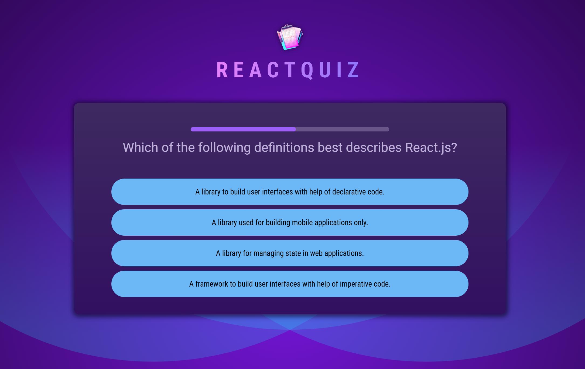

# Quiz App

Live Demo: https://quiz-app-omega-peach-54.vercel.app/

## Overview
A responsive quiz application built using React. 
Users can attempt multiple-choice questions with 10 seconds for each question and receive a detailed result summary showing correct, incorrect, and skipped answers.

## Features
- Multiple choice questions
- Timer-based question flow
- Final result summary with correct, incorrect, and skipped counts
- Responsive layout for different screen sizes

## Screenshots

## What I Learned
- Managing mutable values across renders using useRef
- Handling side effects and timers with useEffect
- Optimizing function re-creation using useCallback
- Implementing timer-based logic for quiz flow
- Structuring components to manage quiz state cleanly

## Tech Stack
- React
- Vite
- JavaScript
- CSS

## Installation

Clone the repository:

git clone <repo-link>

Install dependencies:

npm install

Run locally:

npm run dev

Build:

npm run build
